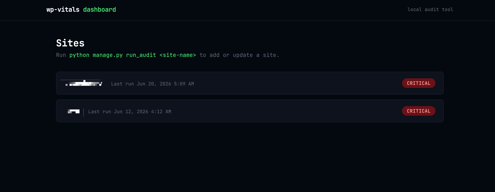
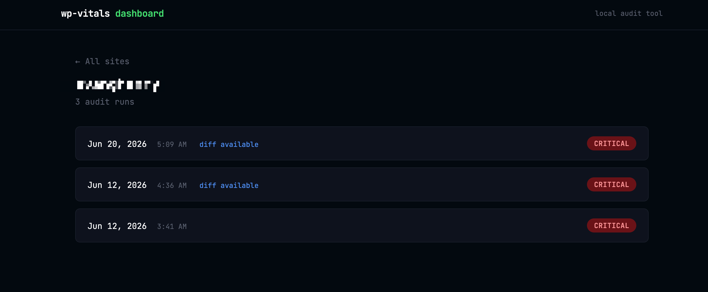
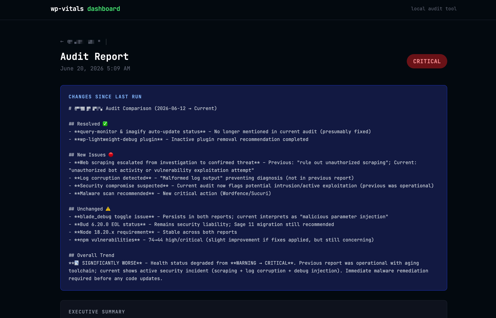

# wp-vitals-dashboard

A Django application that runs AI-powered WordPress site health audits, stores results in Postgres, and generates a diff
report between runs showing what's been resolved, what's new, and what remains.

Built as the persistence and history layer on top of [wp-vitals](https://github.com/bisonbrah/wp-vitals).

---

## What it does

Point it at any local WordPress install and it runs a full audit across three dimensions:

- **Error logs** — surfaces critical issues, fatal errors, and deprecation patterns
- **Plugins** — flags outdated plugins, major version jumps, inactive installs, and auto-update gaps
- **Theme dependencies** — detects the theme framework, recommends the correct Node version, and identifies safe vs.
  unsafe npm updates

Results are stored in Postgres. On subsequent runs it compares the new report to the previous one and generates an AI
diff — telling you exactly what got fixed, what's new, and what's still open.

---

## The iterative loop

```bash
# Inherit a new site, run the first audit
python manage.py run_audit my-client-site --theme my-theme

# Fix issues, then run again
python manage.py run_audit my-client-site --theme my-theme

# The second run automatically diffs against the first
# and tells you what changed
```

---

## Screenshots

### Dashboard — all audited sites with health status



### Site detail — full audit history with diff indicators



### Report detail — full audit output with AI diff



The diff section compares the current run to the previous one:

- **Resolved** — issues from the last run that are no longer present
- **New Issues** — issues that weren't in the previous report
- **Unchanged** — issues that persist between runs
- **Overall Trend** — is the site getting better, worse, or stalled?

---

## Stack

- **Django 6** — web framework and ORM
- **PostgreSQL** — persistent storage for sites and report history
- **Tailwind CSS** — frontend styling via CDN
- **Anthropic Claude Haiku** — audit analysis and diff generation
- **wp-vitals** — the underlying audit engine (log analyzer, plugin auditor, theme dependency auditor)

---

## Requirements

- Python 3.10+
- PostgreSQL
- [wp-vitals](https://github.com/bisonbrah/wp-vitals) cloned locally
- Anthropic API key
- WP-CLI (for plugin audits)
- Node.js + npm (for theme audits)

---

## Setup

1. Clone the repo:
   ```bash
   git clone https://github.com/bisonbrah/wp-vitals-dashboard.git
   cd wp-vitals-dashboard
   ```

2. Create and activate a virtual environment:
   ```bash
   python3 -m venv .venv
   source .venv/bin/activate
   ```

3. Install dependencies:
   ```bash
   pip install -r requirements.txt
   ```

4. Create a `.env` file in the project root:
   ```
   SECRET_KEY=your-django-secret-key
   DB_NAME=wp_vitals
   DB_USER=your-postgres-username
   DB_PASSWORD=
   DB_HOST=localhost
   DB_PORT=5432
   ANTHROPIC_API_KEY=your-api-key
   ```

5. Update the wp-vitals path in `dashboard/settings.py`:
   ```python
   sys.path.insert(0, '/path/to/your/wp-vitals')
   ```

6. Create the database and run migrations:
   ```bash
   createdb wp_vitals
   python manage.py migrate
   ```

7. Create a superuser for the admin:
   ```bash
   python manage.py createsuperuser
   ```

8. Start the server:
   ```bash
   python manage.py runserver
   ```

9. Visit `http://127.0.0.1:8000` for the dashboard
   Visit `http://127.0.0.1:8000/admin` for the Django admin

---

## Running an audit

```bash
# Full audit with theme specified
python manage.py run_audit site-folder-name --theme theme-folder-name

# Full audit, scope logs to last 7 days
python manage.py run_audit site-folder-name --days 7

# Without theme flag -- auto-detects first theme with package.json
python manage.py run_audit site-folder-name
```

The site folder name must match the folder name under your `LOCAL_SITES_PATH` (configured in your wp-vitals `.env`).

---

## Notes

- `.env` is gitignored -- never commit secrets
- The wp-vitals path in `settings.py` is hardcoded to your local machine -- update it after cloning
- Designed for Local by Flywheel installs; plugin audits require the target site to be running
- API costs per full audit run are a few cents using Claude Haiku